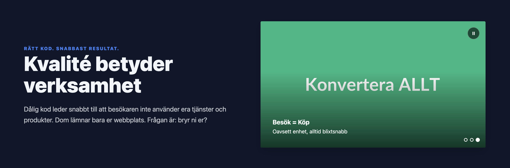

# projektnano.xyz - Hemsidan

Grundar sig på en filosofi om att att allt innehåll faktiskt kan levereras **från en och samma plats**, och från **en och samma fil** med ett undantag - användandet av en **JSON** fil.

Filosofin är en sak, att skapa något som använder best practice och som följer de riktlinjer mm som finns från W3c (The World Wide Web Consortium) är till och från något annat, varav det alltid kommer råda olika perspektiv gällande vad som är just "best practice" och inte.

**Utseende kommer att ändras.**

## W3c - validering av...

Att skapa det som är tänkt att komma här inom kort är till stor del en subjektiv åsikt medans olika verktyg för validering av HTML, CSS m.m som [W3c tillhandahåller](https://www.w3.org/developers/tools/)  inte alltid enligt vissa åsikter, samt vissa webbläsare, är korrekt - så faller valet på att förhålla sig till W3c.

## Leverans av filer från GitHub

Som alla redan vet så bestämer servern algoritm men fattar den fattar också beslut baserat på klientens `Accept-Encoding-header` vilket beror på webbläsare/proxy. 
Server kan också ha policyer / konfiguration gäälande prioritering/nivåer och för oss som väljer "hosting" med GitHub Pages så tvingas vi att "lyssna" på vad detta innebär.

## JSON, varför?

För att med rätt metod är det en fråga om en extra request på cirka 100kb till skillnad från att antingen använda en `router` metod inom ett HTML dokument alternativt att ha en template som varje gång skall återanvändas för olika sidor.

Valet föll på att använda EN fil, alltså ett HTML dokument med inline CSS och inline JS där även favicon är inline i base64-format och där en JSON fil hanterar all data och innehåll som visas. Frågan vissa har är; "men om allt är en enda sida, hur visar du enskilda artiklar och liknande?", och svaret är enkelt: med hjälp av JS koden så används samma "vy", alltså samma container, som används för artiklar och därmed så "växlas" bara vyn från grid av artiklar till artikel.

## Fördelar och nackdelar?

Inga. Många. Det beror som alltid på hur man väljer att se det.

Min personliga åsikt är enligt följande;
- varför ha en server som kostar pengar, egentid för drift och underhåll, då man kan åstadkomma (i detta fallet) samma sak med något som inte kostar en krona?
- varför göra det svårare för sig när man inte behöver det?
- för denna hemsidan handlar det om en dokument på totalt cirka 40kb + en JSON fil på cirka 100kb, vilket totalt antagligen resulterar i en webbplats som är bland de mest optimerade samt minsta på marknaden

## Men bilder och annat material då?

Bilder kommer att finnas, men då webbsidan är skapad på ett sätt som gör att dom aldrig behöver vara större än 300*300px valde jag att använda samma bilder i SVG-format. Varför då, undrar kanske vissa - och svaret igen kanske förvånar en del: SVG renderas av webbläsaren och därav krävs ingen extra request och koden för dessa bilder påverkar med totalt mellan 1-3ms, vilket inte är något att "jaga" i syfte att optimera. Så svaret är alltså att SVG-bilder används.

## Minifiering

Ja, givetvis. Allt är minified, men inte ersatt för att göra koden kortare.

## Speciella funktioner, finns det?

Nej, inte egentligen - men allt beror som sagt på hur du ser det. Anser man att ett sökfält och filtering av artiklar baserat på kategori mm som speciellt så ja - då finns det speciella funktioner.

## Storlek, va sa du nu igen?

Den totala storleken på webbplatsen (inkl. bilder) är cirka 140-200kb. "Vad då, vet du inte eller?" Nej, jag vet inte än - men snart.

## Frågor och kontakt

Mejla hit: projektnano.xyz@proton.me
